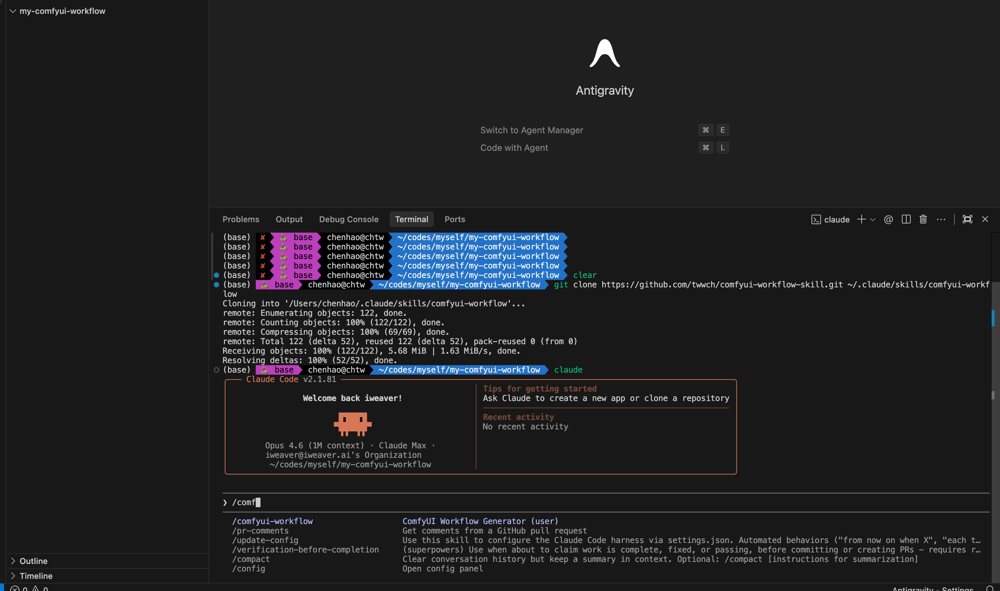
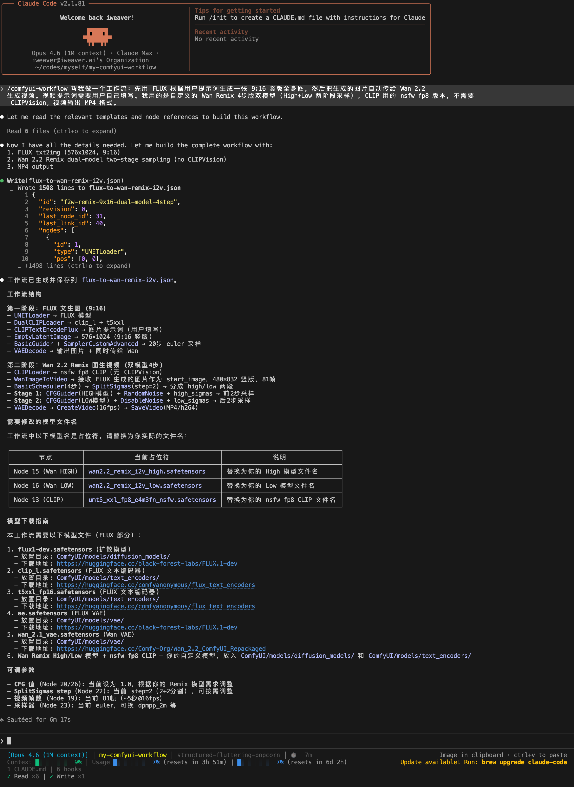
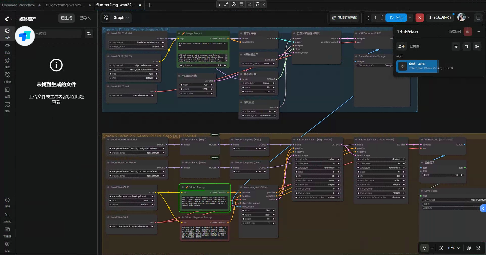
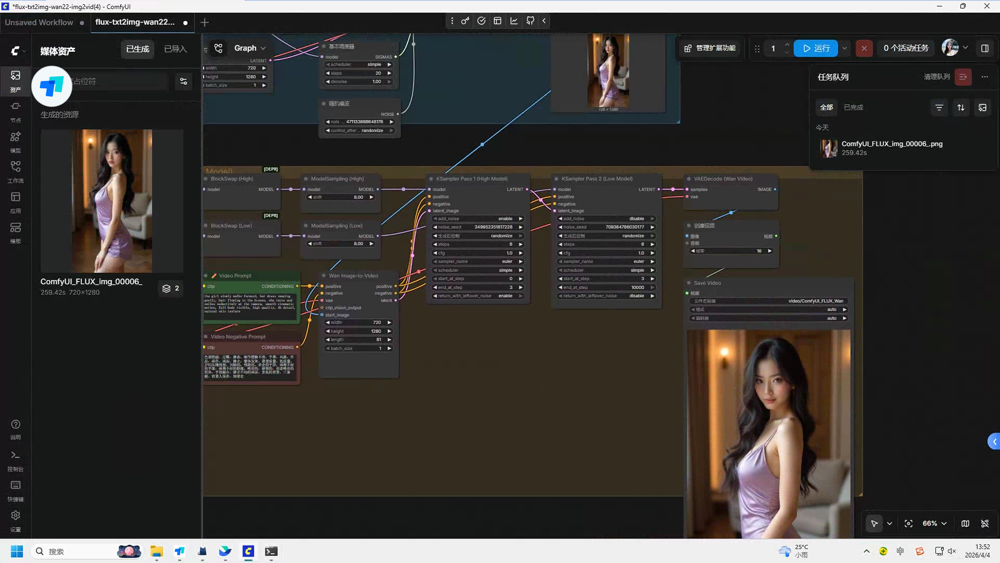
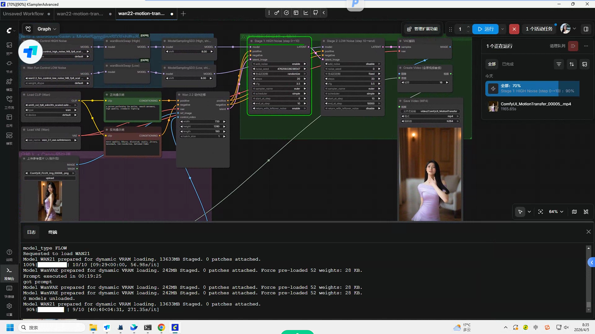
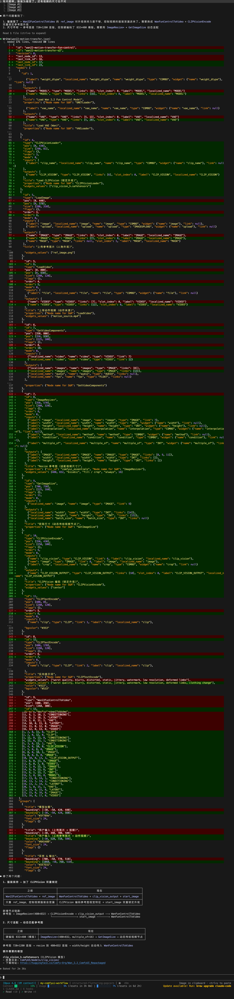
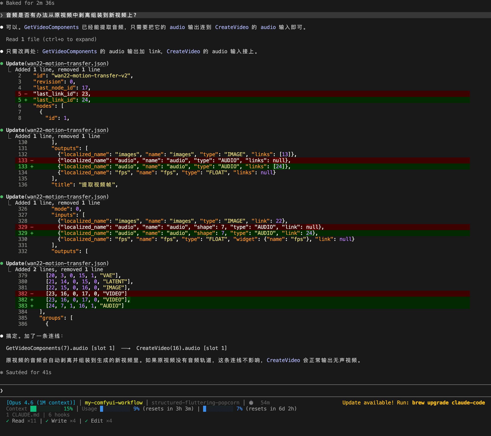

# ComfyUI Workflow Skill

> 用自然语言生成可直接导入 ComfyUI 的工作流 JSON 文件。

**无需 API 费用，无需后端。描述你想要的 → 生成有效的工作流 JSON → 导入 ComfyUI 运行。**

[](https://linux.do/t/topic/1896794)

## 效果展示

### 安装 Skill


### AI 生成工作流 → 导入 ComfyUI → 运行出图



### 生成的图片 & 视频



https://github.com/user-attachments/assets/831e8453-d3fa-41ad-99f6-39b13ce498d0

### 多个 Workflow 合并更新


### 动作迁移

原视频：

https://github.com/user-attachments/assets/8a0affa3-ff07-449e-9ec5-c6ca8c37ba0f

迁移后（显存限制，按低分辨率跑的）：

https://github.com/user-attachments/assets/5420d74e-18eb-4a72-8819-3138d7353edf






## 这是什么？

一个 Claude Code skill，通过对话生成 ComfyUI 工作流 JSON。不用在 ComfyUI 节点编辑器里手动连线，直接用自然语言描述需求即可。

## 功能特性

- **34 个内置模板** — 覆盖所有主流模型和任务类型
- **360+ 节点定义** — 从 ComfyUI 源码提取，确保字段类型和范围准确
- **自动模型下载** — 工作流包含原生 `models` 字段，导入时 ComfyUI 自动检测缺失模型并弹窗下载
- **LLM 集成** — 支持 comfyui_LLM_party 节点 (OpenAI / Claude / Gemini / Ollama / DeepSeek)
- **按需加载节点参考** — 节点注册表拆分为 42 个分类文件，避免一次性加载 4000 行

## 安装

### 前置条件

- [Claude Code](https://docs.anthropic.com/en/docs/claude-code) 已安装
- Git 已安装

### 方法一：Git Clone + 符号链接（推荐，自动同步更新）

```bash
# 1. Clone 项目到本地
git clone https://github.com/twwch/comfyui-workflow-skill.git ~/codes/comfyui-workflow-skill

# 2. 创建符号链接到 Claude Code skills 目录
ln -s ~/codes/comfyui-workflow-skill ~/.claude/skills/comfyui-workflow
```

### 方法二：直接 Clone 到 skills 目录

```bash
git clone https://github.com/twwch/comfyui-workflow-skill.git ~/.claude/skills/comfyui-workflow
```

### 方法三：手动复制

```bash
cp -r comfyui-workflow-skill/ ~/.claude/skills/comfyui-workflow
```

### 验证安装

```bash
ls ~/.claude/skills/comfyui-workflow/SKILL.md
# 应该输出文件路径，说明安装成功
```

### 卸载

```bash
rm -rf ~/.claude/skills/comfyui-workflow
```

## 使用方法

### 基本用法

安装后，在 Claude Code 中直接用自然语言描述需求：

```
"帮我生成一个 FLUX 文生图工作流"
"创建一个 Wan 2.2 图生视频工作流，带相机控制"
"生成一个 SDXL 重绘工作流"
"用 LLM 生成剧本，然后生成角色图和视频"
```

### 使用 slash 命令

```
/comfyui-workflow 生成一个 SD3 文生图工作流
```

### 生成的文件如何使用

1. 工作流 JSON 文件会保存到当前目录
2. 在 ComfyUI 中点击 **Load** 或直接将 JSON 文件拖入界面
3. 如果缺少模型，ComfyUI 会自动弹窗提示下载
4. 点击 **Queue** 运行

## 示例工作流

- [`flux-txt2img-wan22-img2vid.json`](flux-txt2img-wan22-img2vid.json) — **FLUX 文生图 → Wan2.2 图生视频** 全流程工作流
- [`wan22-motion-transfer.json`](wan22-motion-transfer.json) — **Wan2.2 动作迁移** 工作流（参考视频动作 → 生成新视频）

## 可选：安装 LLM 集成

如果需要在工作流中使用 LLM 节点（剧本生成、角色解析、提示词增强等），需要在 ComfyUI 中安装 [comfyui_LLM_party](https://github.com/heshengtao/comfyui_LLM_party)：

```bash
cd ComfyUI/custom_nodes
git clone https://github.com/heshengtao/comfyui_LLM_party.git
pip install -r comfyui_LLM_party/requirements.txt
```

支持的 LLM 提供商：OpenAI、Claude、Gemini、DeepSeek、Ollama 及任何 OpenAI 兼容 API。

## 支持的模板 (34)

### 文生图 / 图生图

| 模板 | 文件 | 说明 |
|------|------|------|
| SD 1.5 文生图 | `sd15-txt2img.json` | 基础 SD 1.5 |
| SD 1.5 图生图 | `sd15-img2img.json` | SD 1.5 img2img |
| SD 1.5 + LoRA | `sd15-lora.json` | SD 1.5 加载 LoRA |
| SD 1.5 + ControlNet | `sd15-controlnet.json` | SD 1.5 ControlNet |
| SD 1.5 重绘 | `sd15-inpaint.json` | SD 1.5 Inpainting |
| SDXL 文生图 | `sdxl-txt2img.json` | SDXL 基础 |
| SDXL 图生图 | `sdxl-img2img.json` | SDXL img2img |
| SDXL + LoRA | `sdxl-lora.json` | SDXL 加载 LoRA |
| SDXL + ControlNet | `sdxl-controlnet.json` | SDXL ControlNet |
| SDXL 重绘 | `sdxl-inpaint.json` | SDXL Inpainting |
| SD3 文生图 | `sd3-txt2img.json` | SD3 + TripleCLIPLoader |
| FLUX 文生图 | `flux-txt2img.json` | FLUX.1 高级采样 |
| FLUX 图生图 | `flux-img2img.json` | FLUX.1 img2img |
| FLUX + LoRA | `flux-lora.json` | FLUX.1 加载 LoRA |

### 视频生成

| 模板 | 文件 | 说明 |
|------|------|------|
| Wan 2.2 文生视频 | `wan22-txt2vid.json` | 832x480, 81 帧 |
| Wan 2.2 图生视频 | `wan22-img2vid.json` | CLIP Vision 编码 |
| Wan 2.2 首尾帧插值 | `wan22-first-last.json` | 首帧+尾帧生成视频 |
| Wan 2.2 控制视频 | `wan22-fun-control.json` | 控制视频 + 参考图 |
| Wan 2.2 相机控制 | `wan22-camera.json` | 相机运动控制 |
| HunyuanVideo 文生视频 | `hunyuan-video.json` | HunyuanVideo T2V |
| HunyuanVideo 图生视频 | `hunyuan-video-i2v.json` | HunyuanVideo I2V |
| LTXV 文生视频 | `ltxv-txt2vid.json` | 768x512, 97 帧 |
| LTXV 图生视频 | `ltxv-img2vid.json` | LTXV img2vid |
| Mochi 文生视频 | `mochi-txt2vid.json` | 848x480 |
| Cosmos 文生视频 | `cosmos-txt2vid.json` | 1280x704 |
| Cosmos 图生视频 | `cosmos-img2vid.json` | Cosmos img2vid |

### 音频 / 3D / 特殊

| 模板 | 文件 | 说明 |
|------|------|------|
| 图片放大 | `upscale-model.json` | RealESRGAN 等 |
| Stable Audio | `stable-audio.json` | 音频生成 (47s) |
| Hunyuan3D v2 | `hunyuan3d-v2.json` | 图片转 3D 模型 |
| Stable Cascade | `stable-cascade.json` | 两阶段生成 |

### LLM 集成

| 模板 | 文件 | 说明 |
|------|------|------|
| LLM 对话 (API) | `comfyui_LLM_party/llm-chat-api.json` | API LLM 对话 |
| LLM 对话 (Ollama) | `comfyui_LLM_party/llm-chat-ollama.json` | 本地 Ollama 对话 |
| LLM 提示词增强 | `comfyui_LLM_party/llm-prompt-enhance.json` | LLM 增强 → FLUX 生图 |
| LLM 剧本流水线 | `comfyui_LLM_party/llm-script-to-video.json` | 剧本 → 角色 → 分镜 |

## 自动模型下载

所有模板都包含 ComfyUI 原生 `models` 字段。导入工作流时，ComfyUI 自动检测缺失模型并弹窗提示下载：

```json
{
  "models": [
    {
      "name": "flux1-dev.safetensors",
      "url": "https://huggingface.co/black-forest-labs/FLUX.1-dev/resolve/main/flux1-dev.safetensors",
      "directory": "diffusion_models"
    }
  ]
}
```

支持 HuggingFace 和 CivitAI 下载源。

## 项目结构

```
comfyui-workflow-skill/
├── SKILL.md                              # Skill 定义（入口文件）
├── README.md                             # 本文件
├── flux-txt2img-wan22-img2vid.json       # AI 生成的示例：FLUX 生图 + Wan2.2 图生视频
├── images/                               # 示例截图和演示视频
├── wechat-article.md                     # 微信推文
├── references/
│   ├── nodes/                            # 42 个节点分类文件 + 索引
│   ├── node-registry-additions.md        # 附加节点定义 (音频、3D 等)
│   ├── workflow-format.md                # JSON 格式规范
│   └── common-workflows.md               # 常见模式
└── templates/                            # 34 个工作流模板
    ├── sd15-txt2img.json
    ├── flux-txt2img.json
    ├── wan22-img2vid.json
    ├── ... (30 个核心模板)
    └── comfyui_LLM_party/                # 4 个 LLM 集成模板
```

## 常见问题

### 导入后提示缺失节点

工作流中使用了自定义节点（如 LLM Party），需要先在 ComfyUI 中安装对应的自定义节点包。

### 导入后模型缺失

ComfyUI 会自动弹窗提示下载。如果没有弹窗，手动从 HuggingFace 下载对应模型文件到 `ComfyUI/models/` 对应子目录。

### widgets_values 报错

如果出现类似 `Value not in list` 的错误，通常是 widget 值类型或范围不对。检查：
- COMBO 类型的值必须是允许列表中的字符串
- seed 后面必须跟 `"randomize"`（ComfyUI 自动添加的 `control_after_generate` 字段）
- FLOAT/INT 值必须在 min/max 范围内

## Contributing

欢迎 PR：
- 新的工作流模板
- 支持更多自定义节点
- 修复生成的 JSON bug
- 文档改进

## License

MIT
